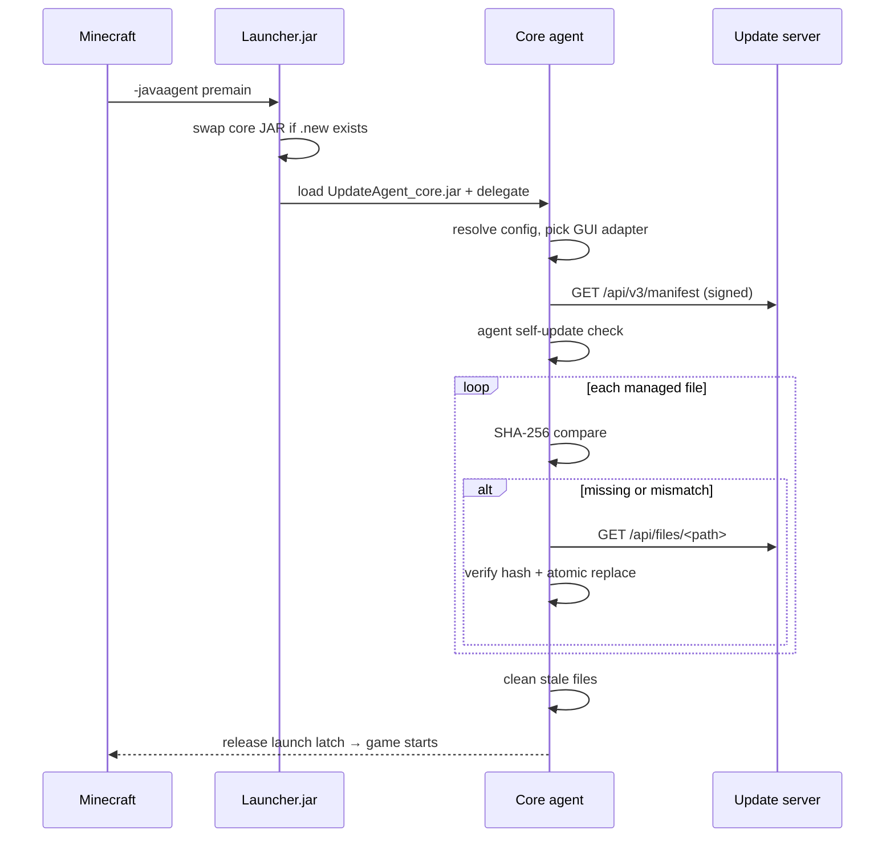

# Minecraft Auto Update Service

> Keep Minecraft client resources in sync across machines — via a self-hosted HTTP API and a Java agent.

- [中文说明](README_CN.md)
- [GUI Adapter API](GUI_ADAPTER_API.md) — build a custom GUI preset.
- [GUI Adapter API（中文）](GUI_ADAPTER_API_CN.md)

## Documentation map

| File | Audience | Purpose |
|------|----------|---------|
| `README.md` / `README_CN.md` | Operators and maintainers | Build, deploy, configure, and navigate the repository. |
| `GUI_ADAPTER_API.md` / `GUI_ADAPTER_API_CN.md` | GUI developers | Public GUI contract, V1 presets, and V2 isolated Java-helper presets. |

## Overview

| Component | Role |
|-----------|------|
| **Server** (Python/Flask, Docker) | Hosts file manifests & resource downloads via a REST API. |
| **Agent** (Java, `-javaagent`) | Loaded at Minecraft startup — checks for updates, shows GUI progress, syncs files, then lets the game launch. |

### Two-JAR design (safe self-update)

| JAR | Role |
|-----|------|
| `UpdateAgent.jar` (Launcher) | Thin wrapper loaded by `-javaagent`. Replaces the core JAR at startup if a `.jar.new` exists, then delegates to it. **Never updated**, which avoids file-lock issues on Windows. |
| `UpdateAgent_core.jar` (Core) | The actual update logic: HTTP sync, GUI, file cleanup. **Can be self-updated** — a new version is downloaded as `.jar.new` and swapped in on the next launch. |

### Startup flow



### Agent source layout

The core agent is composed of small layers (all under `com.zack88604.autoupdater`):

| Package | Responsibility |
|---------|----------------|
| `application` | `UpdateController` (lifecycle), `UpdateService` (business flow), events, state reduction, and rate-limited state rendering. |
| `domain` | `Manifest`, `FileEntry`, `UpdateResult`, `AgentArtifact`. |
| `infrastructure` | `FileManager`, `ServerClient`, JSON parsing. |
| `gui.api` | Toolkit-neutral GUI contracts and Java-helper protocol APIs. |
| `gui.swing` | Built-in Swing adapter and trusted preset chooser. |
| `gui.preset` | V1 in-process and V2 isolated helper preset discovery, validation, and loading. |
| `bootstrap` / `config` | Agent entry point composition and configuration resolution. |

## Quick Start

### Server

```bash
# From this repository root: build the agent first
bash agent/build.sh

# Create persistent server data and publish the current core JAR
mkdir -p /srv/mc-update/files /srv/mc-update/agent /srv/mc-update/gui-presets
cp agent/UpdateAgent_core.jar /srv/mc-update/agent/

# Build and run the server from this repository root
docker build -t mc-update-service .
docker run -d -p 25565:25565 \
  -v /srv/mc-update:/data \
  --name mc-update mc-update-service

# After changing files or update-config.json, regenerate the manifest
docker exec mc-update python3 /app/generate_manifest.py \
  --dir /data/files --out /data --agent-jar /data/agent/UpdateAgent_core.jar
```

### Agent

```bash
# Linux/macOS (requires a JDK with javac)
bash agent/build.sh
bash agent/setup-agent.sh ~/.minecraft/versions/1.20.1 http://your-server:25565 BASE64_X509_ED25519_PUBLIC_KEY

# Windows
agent\build.bat
agent\setup-agent.bat C:\path\to\instance http://your-server:25565 BASE64_X509_ED25519_PUBLIC_KEY
```

The setup script writes server configuration to `mc-update.properties` in the game directory and appends `-javaagent:<path>/UpdateAgent.jar` to the launcher's JVM arguments. It requires the Base64 X.509 Ed25519 public key and writes `server` and `manifest-public-key`; `manifest-key-id` stays optional.

Runtime files owned by the updater:

```text
<game-dir>/
├── mc-update.properties                 # persistent server/debug/adapter settings
└── .mc-update/
    ├── manifest-key-trust.properties     # pinned Ed25519 key(s) of the update server
    ├── signed-manifest-cache.properties  # last fully verified signed manifest
    ├── gui-selection.properties          # optional remembered GUI choice
    ├── gui-server-trust.properties       # approved server URL + preset identity
    ├── gui-presets/                      # local and server-downloaded preset JARs
    └── gui-runtimes/                     # verified V2 helper runtime extraction
```

## Signed-manifest setup

The server generates its persistent Ed25519 signing key under `/data/manifest-keys/` the first time it signs a manifest. Its private key is never exposed. Copy `/data/manifest-keys/manifest-signing-public.der.base64` to each client through an authenticated administrator channel and pin it in `mc-update.properties`:

```properties
server=http://your-server:25565
manifest-public-key=BASE64_X509_ED25519_PUBLIC_KEY
# Optional: manifest-key-id=ed25519-0123456789abcdef
```

When no public key is configured, the client shows a one-time confirmation with the server URL, key ID, and SHA-256 fingerprint; approval pins the key locally. A pinned key is never replaced automatically. The client fetches `/api/v3/manifest` and verifies the Ed25519 signature, expiry, and embedded manifest hash before touching files. The agent runtime requires Java 15 or later for Ed25519. `/api/v3/manifest-public-key` is for administrator inspection only; clients never trust it automatically. `/api/v2/manifest` remains available for legacy clients.

## Safe skip update

After a complete update, the agent verifies every manifest resource locally and atomically caches the already Ed25519-signed v3 envelope in `.mc-update/signed-manifest-cache.properties`. When the user confirms skipping an in-progress update, the agent first rolls back that run, then re-verifies the cached Ed25519 signature, expiry, server identity, manifest hash, and SHA-256/size of every listed local resource. Any missing, changed, expired, or manually modified cache entry blocks Minecraft startup.

## API

| Endpoint | Method | Description |
|----------|--------|-------------|
| `/api/v2/manifest` | GET | Full file manifest (paths, SHA-256, sizes) |
| `/api/v3/manifest` | GET | Ed25519-signed manifest envelope for pinned-key clients |
| `/api/v3/manifest-public-key` | GET | Public-key descriptor for administrator pinning |
| `/api/files/<path>` | GET | Download a resource file |
| `/api/agent` | GET | Download the latest `UpdateAgent_core.jar` |
| `/api/v2/gui-preset` | GET | Optional server GUI-preset descriptor |
| `/api/v2/gui-presets/<archive>.jar` | GET | Archive named by a GUI-preset descriptor |
| `/api/config` | GET | Managed paths & excluded paths configuration |
| `/api/generate` | POST | Generate configured server targets (token-protected) |
| `/api/health` | GET | Health check |

## GUI Adapter Development

The updater renders through a toolkit-neutral GUI boundary. The built-in Swing
adapter is the default; custom toolkits can plug in **without touching update
logic or lifecycle control** in two ways:

| Way | How | When to use |
|-----|-----|-------------|
| **Compile-in + property** | Compile your factory into the core JAR, set `mc-update.gui-adapter=<class>` | You own/rebuild the agent. |
| **External preset** | Drop a V1 adapter JAR or V2 Java-helper JAR into `.mc-update/gui-presets/`, then choose it on first launch | Distributing a GUI independently, no agent rebuild. |

See [GUI Adapter API](GUI_ADAPTER_API.md) for the full tutorial and API reference.

## Configuration

### Server (env vars)

| Variable | Default | Description |
|----------|---------|-------------|
| `PORT` | `25565` | HTTP port |
| `GENERATE_TOKEN` | *(empty)* | Protects `/api/generate` |
| `MANIFEST_SIGNATURE_TTL_SECONDS` | `604800` | Signed-manifest lifetime (1 second–31 days) |
| `DEBUG` | `false` | Flask debug mode |

### Agent (JVM properties)

Configuration is resolved in this order (normal mode):

1. `mc-update.properties` in the game directory *(written by setup script)*
2. Inline `-javaagent` arguments
3. `-D` system properties
4. Built-in defaults

(`admin=true` in the inline arguments reverses to: arguments → system properties → file.)

| Property | Default | Description |
|----------|---------|-------------|
| `mc-update.server` | `http://localhost:25565` | Server URL(s) — comma-separated for **multi-source fallback** |
| `mc-update.game-dir` | `.` | Minecraft directory |
| `mc-update.debug` | `false` | Keep GUI open after sync |
| `mc-update.gui-adapter` | *(built-in Swing)* | Fully qualified `GuiAdapterFactory` class |
| `mc-update.server-gui` | `disabled` | `disabled`, `recommended`, or `required` server-preset policy |
| `mc-update.manifest-public-key` | *(empty)* | Base64 X.509 Ed25519 public key pinned by the administrator. When empty, the first connection asks once for confirmation and pins the key locally |
| `mc-update.manifest-key-id` | *(empty)* | Optional expected `ed25519-…` key identifier; when set it must match the signed manifest |

**Recommended: `mc-update.properties`** (written by setup script):
```properties
server=http://cdn1.example.com:25565,http://cdn2.example.com:8443
```

**Inline agent args**:
```
-javaagent:UpdateAgent.jar=server=http://1.2.3.4:25565,game-dir=C:\mc,debug=true
```

**Multi-server fallback** (automatically tries the next server on failure):
```
-javaagent:UpdateAgent.jar=server=http://cdn1.example.com:25565,http://cdn2.example.com:8443
```

**Admin mode** (`admin=true`) — useful for one-off overrides; the inline value wins:
```
-javaagent:UpdateAgent.jar=admin=true,server=http://override:25565
```

### Server-published GUI presets

A server can publish one optional GUI preset outside the normal game-file
manifest. The configured update server is the trust boundary: the client checks
the descriptor shape plus the downloaded JAR's SHA-256 and size, then asks the
user before first loading each `server URL + preset id` identity. Remote GUI
loading is disabled by default.

The server administrator installs the JAR manually under the mounted data
volume, for example:

    /srv/mc-update/gui-presets/example-javafx-1.2.0.jar

Then configure the publication target in `/srv/mc-update/update-config.json`:

```json
{
  "managed_paths": ["mods/", "config/", "resourcepacks/"],
  "excluded_paths": ["config/secret.cfg"],
  "generation": {
    "targets": ["manifest", "gui-preset"],
    "gui_preset": {
      "id": "example-javafx",
      "version": "1.2.0",
      "file": "example-javafx-1.2.0.jar"
    }
  }
}
```

When `GENERATE_TOKEN` is configured, pass it when triggering publication
without entering the container or uploading code through HTTP:

    curl -X POST https://update.example.com/api/generate \
      -H "X-Generate-Token: $GENERATE_TOKEN"

`/api/generate` reads only this server-side configuration. It validates the
manually installed JAR, computes its hash and size, and atomically replaces
`/srv/mc-update/gui-preset.json` only after validation succeeds. With no
`generation` block, the backward-compatible default target is `["manifest"]`.
The client-facing `/api/config` exposes only `managed_paths` and
`excluded_paths`, never `generation`.

Enable the optional policy on clients:

    server-gui=recommended

`recommended` uses the server preset only when no remembered local choice wins,
while refreshing a selected server preset. `required` overrides a remembered
local choice only after the same server and preset identity has been approved.
`disabled` is the default. An explicit `gui-adapter` class always takes
precedence.

The first use of a server URL + preset id shows an external-code risk warning.
A later version of that identity does not prompt again; changing the server URL
or preset id does. Use HTTPS in production. When configured, the generation Token protects publishing, not client
downloads, and must never be placed in client configuration. Existing key-based approval records require one fresh confirmation after this upgrade.

### Selective Sync (`update-config.json`)

Place this file in the mounted server data root (for the example above,
`/srv/mc-update/update-config.json`).

```json
{
  "managed_paths": ["mods/", "config/", "resourcepacks/", "options.txt"],
  "excluded_paths": ["config/secret.cfg", "mods/skip_this/"]
}
```

| Pattern | Matches |
|---------|---------|
| `path/` (trailing slash) | Everything under that directory, recursively |
| `file.txt` (bare name) | That exact file only |
| `*` | Everything (only valid as a whole `managed_paths` entry) |

`excluded_paths` override `managed_paths` — excluded files are neither synced nor
cleaned up. Defaults: `managed_paths: ["*"]`, `excluded_paths: []`.

**Stale-file cleanup only happens for explicitly listed `managed_paths`.** The
default `["*"]` never deletes anything, because the updater cannot distinguish
managed game files from unrelated ones; list the directories you own (for
example `mods/`) when removed files should be cleaned up.

## Testing

No external test framework or dependency is required.

```bash
# Agent self-check: manifest parsing, key trust, managed-file rules
bash agent/run-tests.sh           # Windows: agent\run-tests.bat

# Server path-confinement tests
python3 -m unittest discover -s server/tests
```

Both the build and test scripts compile with `--release 15`, so a JAR built on
a newer JDK still runs on the Java version Minecraft ships. Set `JAVA_RELEASE`
(for example `JAVA_RELEASE=21`) to change the target.

## Project Structure

```text
├── README.md / README_CN.md              # operator and maintainer guides
├── GUI_ADAPTER_API.md / GUI_ADAPTER_API_CN.md  # public GUI extension contract
├── LICENSE                               # MIT license
├── Dockerfile                            # server image, built from this root
├── server/
│   ├── app.py                            # Flask API
│   ├── entrypoint.sh                     # container entrypoint
│   ├── generate_manifest.py              # manifest generator
│   ├── manifest_signing.py               # Ed25519 manifest signing
│   ├── path_safety.py                    # /api/files path confinement
│   ├── requirements.txt
│   └── tests/                            # path-confinement tests
└── agent/
    ├── META-INF/MANIFEST.MF              # java-agent launcher manifest
    ├── build.sh / build.bat              # builds the two JARs
    ├── run-tests.sh / run-tests.bat      # builds and runs the self-check
    ├── setup-agent.sh / setup-agent.bat  # writes game-directory setup
    ├── test/                             # AgentSelfCheck self-check
    └── src/
        ├── Launcher.java                 # stable launcher, never self-updated
        ├── UpdateAgent.java              # compatibility facade
        └── com/zack88604/autoupdater/
            ├── bootstrap/                # composition root
            ├── config/                   # configuration precedence
            ├── application/              # update flow, cancellation, UI state pump
            ├── domain/                   # manifest value objects
            ├── infrastructure/           # files, HTTP, JSON
            └── gui/
                ├── api/                  # public GUI and helper contracts
                ├── swing/                # built-in fallback GUI
                └── preset/               # V1/V2 external preset runtime
```

Build output:
- `agent/UpdateAgent.jar` — launcher JAR loaded by `-javaagent`
- `agent/UpdateAgent_core.jar` — self-updatable core JAR

## License

MIT
